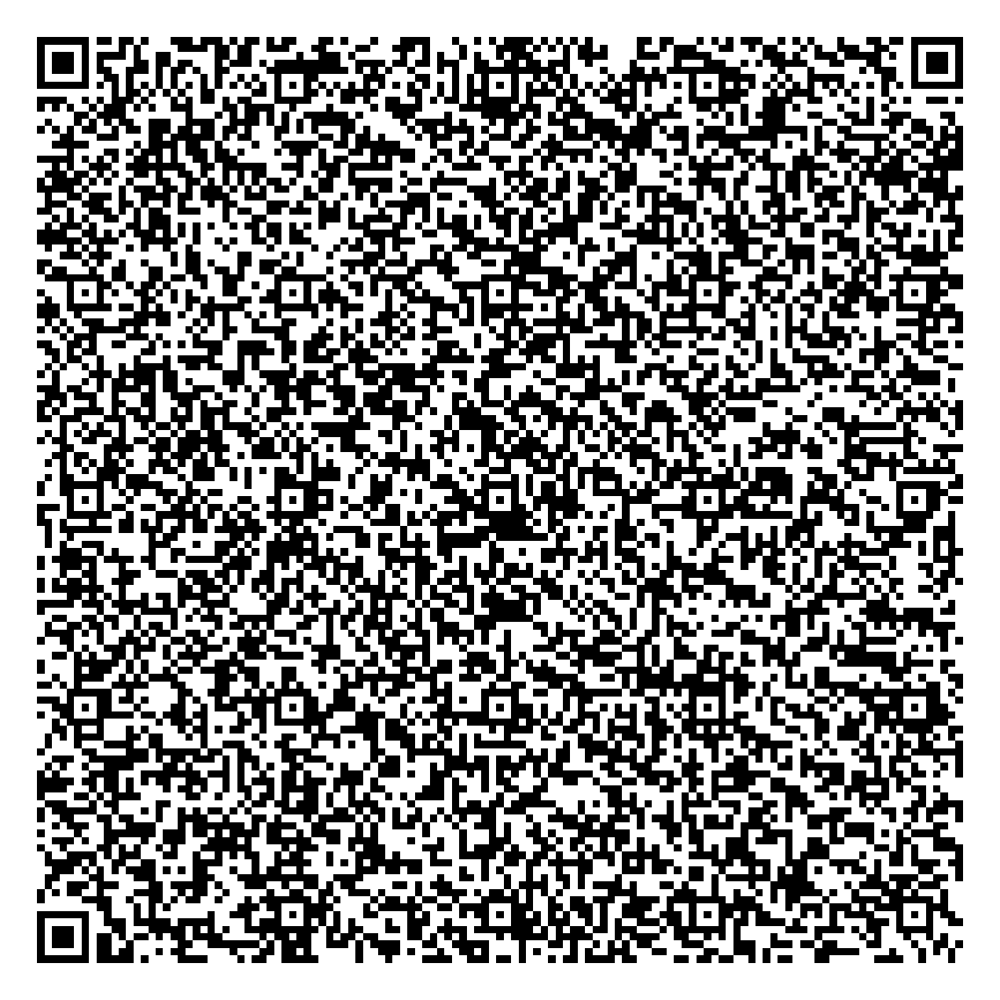

# blahaj

A wise blahaj tells wise quotes

## What it does
1. Fetch quotes from an api on click
2. Display quotes

in the making:
- Bookmarking quotes
- Fetching quotes in the background for faster responses

## qr code version
the qr code version (simple version.html) is made for say cheese
it is smaller so it can fit on a qr code
here is the qr code:

